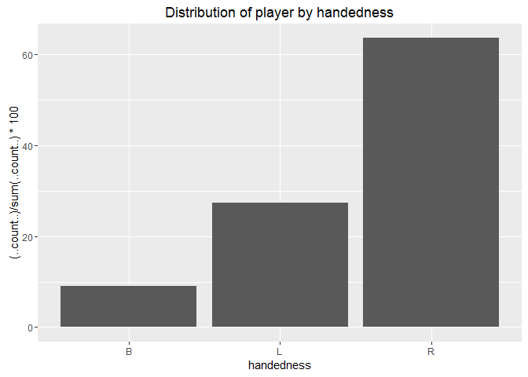
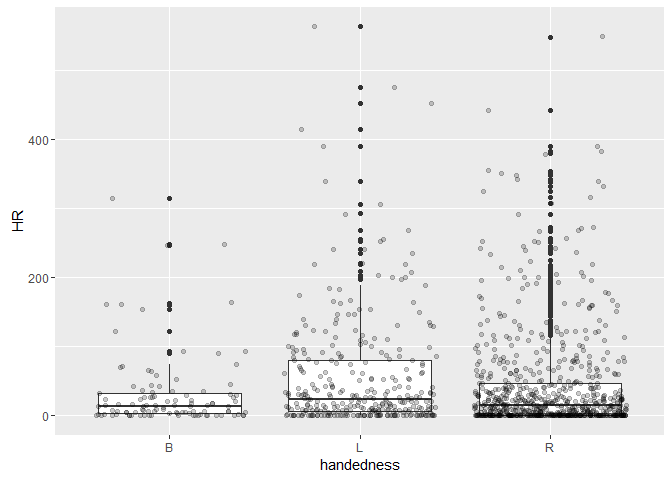
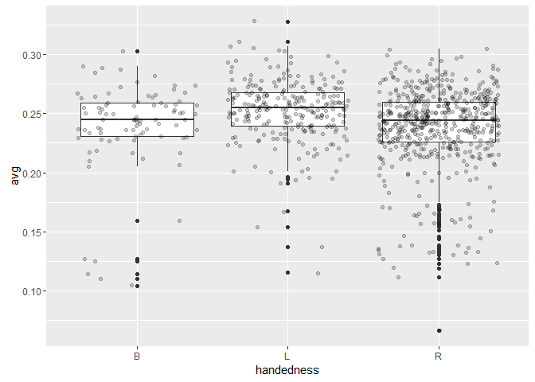

# EDA sketches


First sketches for Baseball data visualization

## Load Data


```r
baseball <- read.csv("data/baseball_data.csv")
baseball$name <- as.character(baseball$name)

# Convert units to cm and kg.
# Create a BMI category. Inspired by "hondaryo00888005 udacity user"
cm_in_inches <- 2.54
kg_in_pounds <- 0.453592
baseball <- mutate(baseball, height = height * cm_in_inches,
                             weight = weight * kg_in_pounds,
                             bmi = weight / (height/100)^2,
                             bmi_class = cut(bmi,
                                             breaks=c(0,18.5,25,40),
                                             labels=c("underweight", 
                                                      "normal", "overweight")))
```
## Story Time
Left handed people are 10% of the world population, yet 35% of baseball players are left-handed. (
http://psycnet.apa.org/journals/bul/84/3/385/
http://blogs.discovermagazine.com/discoblog/2008/07/08/why-do-so-many-lefties-play-baseball-its-built-for-them/ )

Are they better players?

## Plotting

### Proportion of handedness:

```r
ggplot(baseball, aes(x = handedness))+geom_bar(aes(y = (..count..)/sum(..count..)*100))+
  ggtitle("Distribution of player by handedness")
```

<!-- -->

### Performance:


```r
ggplot(baseball, aes(x=handedness, y = HR))+geom_boxplot()+geom_jitter(alpha=1/5)
```

<!-- -->

```r
ggplot(subset(baseball, avg!=0), aes(x=handedness, y = avg))+geom_boxplot()+geom_jitter(alpha=1/5)
```

<!-- -->


